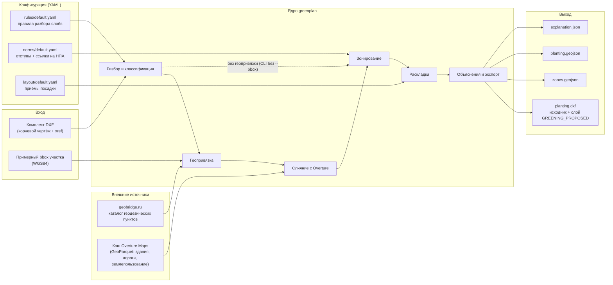
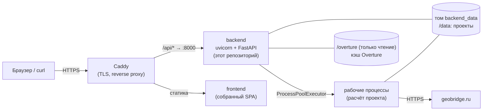

# greenplan — сервис автоматического проектирования озеленения (бэкенд)

Бэкенд решения команды Green Leaders для кейса ДПиООС (ЛЦТ-2026). Сервис читает
DXF-подоснову улицы или участка (топосъёмка, инженерные сети, генплан), строит карту
«где можно сажать» по нормативным отступам (743-ПП, СП 42.13330.2016, МГСН 1.02-02 /
623-ПП, ПП РФ № 160) и раскладывает по ней деревья и кустарники по типовым приёмам.
Результат записывается обратно в DXF отдельным слоем `GREENING_PROPOSED`. Кроме DXF
сервис выдаёт GeoJSON зон и посадок и JSON с объяснениями.

Бэкенд работает двумя способами:

- **CLI** `greenplan` — полный прогон DXF → DXF без сервера и сети;
- **HTTP API** на FastAPI, со Swagger UI на `/docs`. Им пользуется веб-клиент (отдельный
  репозиторий `frontend`).

---

## Содержание

1. [Назначение и границы решения](#1-назначение-и-границы-решения)
2. [Архитектура](#2-архитектура)
3. [Алгоритм](#3-алгоритм)
4. [Методы и библиотеки](#4-методы-и-библиотеки)
5. [Сборка, запуск и проверка](#5-сборка-запуск-и-проверка)
6. [Способы взаимодействия](#6-способы-взаимодействия)
7. [HTTP API и Swagger](#7-http-api-и-swagger)
8. [Ограничения, допущения, известные ошибки](#8-ограничения-допущения-известные-ошибки)

---

## 1. Назначение и границы решения

Сервис помогает проектировщику озеленения. Он принимает комплект DXF по объекту и
предлагает план посадок деревьев и кустарников. План соблюдает нормативные отступы, и
каждое решение ссылается на пункт НПА. Устроен сервис алгоритмически: правила,
геометрические буферы и эвристики раскладки. Нейросетей и обученных моделей в нём нет.
Такой подход выбран, чтобы результат был воспроизводимым и объяснимым.

### Что входит в MVP

| Возможность | Состояние |
|---|---|
| Чтение DXF-комплекта: поиск корневого чертежа, разрешение внешних ссылок (xref), разбор блоков (INSERT), штриховок (HATCH), полилиний, текста | ✅ |
| Классификация слоёв по правилам (регулярные выражения по имени слоя или блока): граница работ, газон, подземные сети по типам, здания, борт, проезжая часть, тротуары, существующие деревья, опоры, ЛЭП, откосы и подпорные стенки, колодцы, красные линии, горизонтали, геодезические пункты | ✅ |
| Отчёт о покрытии слоёв правилами (какие слои не распознаны) | ✅ |
| Зонирование: допустимая зона = газон ∩ граница работ минус буферы нормативных отступов, отдельно для деревьев и для кустарников | ✅ |
| Раскладка: рядовая посадка деревьев вдоль борта, живая изгородь вдоль борта, заполнение свободного газона деревьями и кустарниками по сетке | ✅ |
| Выгрузка в DXF: исходный чертёж плюс ровно один новый слой `GREENING_PROPOSED`; исходные объекты и слои не меняются | ✅ |
| Интерпретируемость: ссылка на НПА, пункт и таблицу для каждой запрещённой зоны; правило размещения для каждой точки; справочник норм `GET /norms` | ✅ |
| Геопривязка DXF по геодезическим пунктам (geobridge.ru, жёсткое преобразование, контроль невязок) | ✅ (в API обязательна, в CLI по флагу `--bbox`) |
| Слияние с открытыми данными Overture Maps: здания, в том числе школы и детсады, и проезжая часть с категорией улицы | ✅ (только для геопривязанных проектов) |
| Настройка без изменения кода: правила разбора, нормы и приёмы посадки хранятся в YAML и подменяются флагами CLI | ✅ |
| Версии плана с ручными правками (добавить, переместить, удалить, сменить тип) и выгрузка DXF каждой версии | ✅ (API) |
| Docker-образ, OpenAPI / Swagger | ✅ |

### Что оставлено на развитие

- **Травянистые покрытия и элементы скверов.** Газон служит только областью, где можно
  сажать. Отдельных рекомендаций по покрытиям и малым архитектурным формам нет.
- **Бонусное задание** (фотореалистичные визуализации после выгрузки DXF) в бэкенде не
  реализовано.
- **Климатические, почвенные и инсоляционные условия, плотность застройки** в расчёте не
  учитываются. Спроектирована иерархия зон «грунт / не грунт → нормативные отступы →
  пригодность» на данных Overture, но она не реализована.
- **Данные публичных кадастров** не загружаются. Красные линии из чертежа распознаются,
  но в зонирование не попадают.
- **Проверка ручных правок по зонам на сервере.** Сейчас её выполняет только веб-клиент;
  в объяснениях такие точки помечены `zone_check: "not_checked"`.
- **Формат DWG** не поддерживается, нужен DXF.
- **Подсказка корневого чертежа через API** (аналог флага `--root` в CLI) не реализована.
- **Kubernetes** не используется. Развёртывание: Docker Compose на одной ВМ.

---

## 2. Архитектура

### Компоненты

```
greenplan/
  io/dxf_source.py      поиск .dxf, определение корневого чертежа, разрешение xref
  geometry.py           сущности DXF → геометрии shapely (HATCH, INSERT, полилинии, TEXT)
  classify/, rules/     классификация слоёв по правилам (rules/default.yaml)
  coverage.py           отчёт: сколько объектов нашло каждое правило, какие слои не распознаны
  georeference/         геопривязка: геодезические пункты → geobridge.ru → жёсткое преобразование
  overture/, fusion/    кэш Overture Maps (GeoParquet) и слияние зданий и дорог с планом
  norms/                таблица нормативных отступов с источниками (norms/default.yaml)
  zoning/               допустимые и запрещённые зоны (буферы, топология полигонов)
  layout/               раскладка посадок по декларативным приёмам (layout/default.yaml)
  explain/              объяснение для каждой точки
  export/               GeoJSON (зоны, посадки, распознанные объекты, геодезические пункты)
  io/dxf_sink.py        запись итогового DXF со слоем GREENING_PROPOSED
  pipeline.py           оркестрация: parse_folder(), plant_folder(), геопривязка, слияние
  cli.py                CLI (typer): parse, plant, overture
  api/                  HTTP API (FastAPI): проекты, загрузка, фоновые задачи, результаты, версии
```

Расчётное ядро (`pipeline.py` и модули под ним) не зависит от способа запуска. CLI и API
вызывают одни и те же функции.

### Потоки данных



### Схема развёртывания



- Бэкенд собирается в один Docker-образ (`Dockerfile`, `python:3.12-slim`, запуск от
  непривилегированного пользователя). Внутри работает один процесс uvicorn. Тяжёлые расчёты
  идут в отдельных процессах (`ProcessPoolExecutor`), по умолчанию не больше двух
  одновременно (`GREENPLAN_API_MAX_CONCURRENT_JOBS`). Если чертёж «вешает» или роняет
  процесс, API продолжает работать.
- Хранилище файловое, без СУБД. Каждый проект — каталог в `/data/projects/<id>/`
  (`metadata.yaml`, `job.yaml`, `raw/`, `processed/`).
- На стенде бэкенд, фронтенд и Caddy запускаются через общий `docker-compose.yml` из
  отдельного репозитория `ci`. Kubernetes не используется.
- Больше одного воркера uvicorn или больше одной реплики запускать нельзя. Лимит
  одновременных задач и кэш метаданных хранятся в памяти одного процесса.

---

## 3. Алгоритм

### 3.1. Схема процесса (от входного DXF к выходному)

```mermaid
flowchart TD
    S(["Старт: папка комплекта DXF<br/>(CLI) или zip-архив (API)"]) --> A1["Найти все .dxf"]
    A1 --> A2{"Корневой чертёж<br/>определён однозначно?"}
    A2 -- "нет (несколько кандидатов)" --> X1(["Ошибка ambiguous_root_dxf<br/>+ список кандидатов<br/>(CLI: указать --root)"])
    A2 -- да --> A3["Прочитать корень, подгрузить xref,<br/>раскрыть блоки INSERT"]
    A3 --> A4["Классифицировать каждую сущность<br/>по имени слоя/блока (rules/default.yaml)"]
    A4 --> A5["Сущности → геометрии shapely<br/>(ремонт невалидных полигонов)"]
    A5 --> A6["parsed.geojson + отчёт о покрытии слоёв"]
    A6 --> B1{"Задан bbox?<br/>(API: всегда)"}
    B1 -- нет --> Z0
    B1 -- да --> B2["Извлечь подписанные геодезические пункты"]
    B2 --> B3["Найти каждый пункт на geobridge.ru<br/>(только однозначное совпадение в bbox)"]
    B3 --> B4{"≥ 2 пунктов?"}
    B4 -- нет --> X2(["Ошибка insufficient_geodetic_points"])
    B4 -- да --> B5["Подобрать жёсткое преобразование<br/>(поворот + сдвиг, масштаб = 1)<br/>DXF → UTM 37N"]
    B5 --> B6{"Макс. невязка ≤ 1 м?"}
    B6 -- "нет, ≥ 4 пунктов" --> B7["Исключить один худший пункт<br/>(leave-one-out) и повторить"]
    B7 --> B6
    B6 -- "нет" --> X2
    B6 -- да --> B8["Перевести все объекты в UTM"]
    B8 --> F1["Слияние с Overture:<br/>здания (+ школы/детсады),<br/>проезжая часть и категория улицы,<br/>переклассификация бортов"]
    F1 --> Z0
    Z0["Базовая область = газон ∩ граница работ"] --> Z1["Для каждой нормы (препятствие × тип растения):<br/>буфер препятствия на норм. отступ"]
    Z1 --> Z2["Допустимая зона[тип] = база − ∪ буферов<br/>Запрещённая зона = буфер ∩ база<br/>+ ссылка на НПА, пункт, отступ"]
    Z2 --> L1["Раскладка по приёмам, по порядку:<br/>1) деревья рядом вдоль борта<br/>2) деревья на свободном газоне<br/>3) живая изгородь вдоль борта<br/>4) кустарники на свободном газоне"]
    L1 --> L2["Каждая точка: внутри допустимой зоны<br/>+ шаг до уже поставленных того же типа"]
    L2 --> E1["Объяснение к каждой точке<br/>(правило, тип, координаты)"]
    E1 --> E2["Точки → обратно в систему координат чертежа"]
    E2 --> E3["Открыть корневой DXF на чтение,<br/>добавить слой GREENING_PROPOSED:<br/>окружность + XDATA на каждую точку,<br/>сохранить в НОВЫЙ файл"]
    E2 --> E4["zones.geojson, planting.geojson<br/>(WGS84 при геопривязке)"]
    E3 --> FIN(["planting.dxf + zones.geojson +<br/>planting.geojson + explanation.json"])
    E4 --> FIN
```



### 3.2. Работа со слоями DXF

1. **Корневой чертёж.** В комплекте обычно несколько файлов, связанных внешними ссылками
   (xref). Корнем считается файл, который ссылается на другие и на который никто не
   ссылается. Если xref уже внедрены (bind), выбирается единственный непустой файл без
   входящих ссылок. Если кандидатов несколько, сервис не угадывает: он возвращает ошибку
   со списком кандидатов. В CLI корень можно указать вручную флагом `--root`.
2. **Классификация.** Каждой сущности по имени слоя, а для INSERT ещё и по имени блока,
   присваиваются категория и подтип (`rules/default.yaml`). Например, слой с «газопровод»
   → `underground_utilities/gas`. Шаблоны намеренно не привязаны к началу и концу строки:
   внедрённые xref переименовывают слои в `<файл>|Слой` или `<файл>$0$Слой`.
3. **Блоки.** Если INSERT совпал с правилом с флагом `expand_blocks` (здания, сети,
   борта), сервис раскрывает его в дочернюю геометрию. У точечных объектов (деревья,
   опоры) используется точка вставки. Если INSERT ни с одним правилом не совпал, он
   раскрывается рекурсивно, и каждый дочерний объект классифицируется по своему слою:
   внутри такого «контейнера» бывают десятки тысяч реальных объектов.
4. **Геометрия.** HATCH, полилинии, окружности, дуги и текст переводятся в геометрии
   shapely. Невалидные полигоны исправляются (`make_valid`), микроскопический шум
   отбрасывается. Разорванные контуры границ и газонов «сшиваются»: концы линий
   притягиваются в пределах 1,5 м. Вложенные контуры восстанавливаются как отверстия и
   острова по правилу even-odd. Почти одинаковые дубликаты (IoU ≥ 0,98) схлопываются в
   один.
5. **Запись результата.** Исходный файл открывается только на чтение. Новые объекты
   добавляются в копию документа в памяти, а она сохраняется в **другой** файл, в формате
   исходника (ASCII или binary). Исходные слои и объекты не меняются. Добавляется ровно
   один слой `GREENING_PROPOSED` (цвет 3, зелёный). На каждую посадку приходится одна
   окружность: у дерева радиус 1,5 м, у кустарника 0,35 м. К окружности прикреплены XDATA
   приложения `GREENPLAN`: `[plant_type, rule_id, id, kind]`.

### 3.3. Нормативные отступы

Таблица `greenplan/norms/default.yaml` задаёт для каждой пары «категория препятствия ×
подтип» отступ до оси ствола дерева и до оси кустарника, а также источник: акт, пункт или
таблицу, текст нормы и ссылку. Основные значения:

| Препятствие | Дерево, м | Кустарник, м | Источник |
|---|---|---|---|
| Наружная стена здания | 5,0 | 1,5 | 743-ПП, прил. 1, п. 3.6.3, табл. 3.6.1 |
| Стена школы / детского сада | 10,0 | 1,5 | 743-ПП, табл. 3.6.1 |
| Край проезжей части (борт), категория неизвестна | 2,0 | 1,0 | 743-ПП, табл. 3.6.1; СП 42.13330.2016, табл. 9.1 |
| Магистральная улица общегородского значения | 7,0 | 1,0 | МГСН 1.02-02, п. 9.2.2.2, табл. 9.1 |
| Магистральная улица районного значения | 4,0 | 1,0 | МГСН 1.02-02, табл. 9.1 |
| Улица местного значения | 3,0 | 1,0 | МГСН 1.02-02, табл. 9.1 |
| Край тротуара / дорожки | 0,7 | 0,5 | 743-ПП, табл. 3.6.1 |
| Трамвайные пути (ось / край полотна) | 5,0 | 3,0 | 743-ПП, табл. 3.6.1; СП 42.13330.2016, табл. 9.1 |
| Опора, мачта, фонарь | 4,0 | 4,0* | 743-ПП, табл. 3.6.1 |
| Подпорная стенка / откос | 3,0 / 1,0 | 1,0 / 0,5 | 743-ПП, табл. 3.6.1 |
| Газопровод, канализация | 1,5 | 1,5* | 743-ПП, табл. 3.6.1 |
| Тепловая сеть | 2,0 | 1,0 | 743-ПП, табл. 3.6.1 |
| Водопровод, дренаж | 2,0 | 2,0* | 743-ПП, табл. 3.6.1 |
| Силовой кабель, кабель связи | 2,0 | 0,7 | 743-ПП, табл. 3.6.1 |
| ЛЭП, напряжение неизвестно / по классам напряжения | 1,25 / 2–55 | то же | ПУЭ; ПП РФ от 24.02.2009 № 160 |
| Существующее дерево | 6,0* | 1,5* | нормы нет, значение сервиса |

`*` — акт не задаёт расстояние. Такое значение помечено `basis: service_default`, и в его
цитате нет ссылки на акт как на источник требования. Там, где в норме диапазон
(«5–7 м»), берётся верхняя граница. Там, где для кустарника стоит прочерк, берётся
значение для дерева (консервативно). Полный список (≈ 40 строк) с формулировками:
`GET /norms` или сам YAML-файл.

### 3.4. Зонирование

1. **Базовая область** = газон ∩ граница работ. Газон — штриховки зон озеленения; граница
   — слой «Граница работ». Если границы нет, берётся весь газон, и в лог пишется
   предупреждение.
2. Для каждой нормы и каждого типа растения (дерево, кустарник) все препятствия этой
   категории **по отдельности** буферизуются на нормативный отступ и объединяются. Буфер
   вычитается из допустимой зоны этого типа.
3. Пересечение буфера с базовой областью сохраняется как **запрещённая зона** с причиной и
   нормой (см. 3.7).
4. Итог: две допустимые зоны (`allowed` для `tree` и `shrub`) и 15–20 сгруппированных
   запрещённых зон. Если категория распознана, но нормы для неё нет, это записывается в
   лог (`uncovered_categories`). Такая категория препятствием не считается.

Для геопривязанных проектов перед зонированием выполняется слияние с Overture Maps:

- **Здания.** Полигоны плана сохраняются. Контуры Overture, которых нет в плане,
  добавляются как препятствия. Школы и детские сады выделяются по классу здания или по
  участку образовательного учреждения; для них отступ 10 м.
- **Дороги.** Полигоны проезжей части берутся из плана или восстанавливаются: свободное
  пространство между бортами, зданиями и газонами разбивается на грани, и грань, которую
  пересекает осевая линия дороги Overture, считается проезжей частью. Категория улицы
  определяется по подсказке в плане и классу дороги Overture. Отступ дерева зависит от
  категории: 7, 4, 3 или 2 м. Борт у проезжей части получает категорию улицы. Борт рядом
  с проезжей частью, но не на её краю, считается бортом тротуара (0,7 / 0,5 м).

### 3.5. Типы посадок и приоритеты

Приёмы посадки описаны декларативно в `greenplan/layout/default.yaml` и применяются
**строго по порядку**. Раньше идут более «регулярные» городские решения, потом
заполнение свободного места:

| Порядок | Правило | Тип | Приём | Шаг, м | Смещение от борта, м |
|---|---|---|---|---|---|
| 1 | `TREE_ROW_CURB` | дерево | рядовая / аллейная посадка вдоль борта | 6,0 | 2,2 (или отступ борта + 0,2) |
| 2 | `TREE_FILL_LAWN` | дерево | групповая / одиночная посадка на свободном газоне (сетка) | 5,0 | — |
| 3 | `SHRUB_HEDGE_CURB` | кустарник | живая изгородь вдоль борта | 1,5 | 1,2 (или отступ борта + 0,2) |
| 4 | `SHRUB_FILL_LAWN` | кустарник | группы кустарников на свободном газоне (сетка) | 3,0 | — |

- **Вдоль борта.** По линии борта с заданным шагом откладываются точки. Каждая
  переносится по нормали на смещение: сначала в одну сторону, если там нельзя — в
  другую. Смещение не меньше отступа от этого борта + 0,2 м. Например, у магистрали
  общегородского значения это 7,2 м вместо 2,2 м.
- **Заполнение газона.** По допустимой зоне раскладывается регулярная сетка с заданным
  шагом.
- **Проверки для каждого кандидата:** (а) точка лежит внутри допустимой зоны своего
  типа, то есть все нормативные отступы уже соблюдены; (б) до точек того же типа,
  поставленных предыдущими правилами, не меньше шага правила. Затем кандидаты
  прореживаются между собой.
- Шаг и смещение настраиваются: `--planting-rules my_layout.yaml`. Шаг живой изгороди
  1,5 м — упрощение MVP. Реалистичные 0,3–0,4 м дают на порядок больше точек.

### 3.6. Геопривязка

Чертежи в местной системе координат. Чтобы использовать внешние данные и показать
результат на карте, сервис:

1. находит в чертеже подписанные геодезические пункты (слой «геодезические пункты» + текст
   с номером);
2. ищет каждый номер в каталоге geobridge.ru. Номера в каталоге не уникальны по стране,
   поэтому засчитывается только **однозначное** совпадение внутри bbox участка, заданного
   пользователем;
3. подбирает жёсткое 2D-преобразование (поворот + сдвиг, масштаб зафиксирован = 1) в UTM,
   зона 37N (EPSG:32637);
4. проверяет невязки. 2 пункта → `unvalidated`. 3 и больше пунктов с максимальной
   невязкой ≤ 1 м → `validated`. При 4 и больше пунктах один выброс может быть исключён
   автоматически; он остаётся в отчёте с пометкой `excluded: true`.

Зонирование и раскладка работают в UTM. От переноса и поворота расстояния не меняются.
Для записи в DXF точки переводятся обратно в систему координат чертежа. GeoJSON
выгружается в WGS84.

### 3.7. Интерпретируемость: как формируется объяснение

Объяснение строится на трёх уровнях, и каждый проверяется по источнику:

1. **Почему здесь нельзя** — запрещённые зоны в `zones.geojson`
   (`zone_type: "prohibited"`). У каждой зоны есть:
   - `obstacle_category` / `obstacle_subtype` — от чего отступ (например, `underground_utilities/gas`);
   - `plant_type` и `distance_m` — для какого типа растения и какой отступ;
   - `reason` — например, «< 1.5 м от объекта типа «gas»»;
   - `citation` — короткая ссылка, например «743-ПП, табл. 3.6.1 …»;
   - `norm_id` — идентификатор записи в `GET /norms` (`<строка>-tree` / `<строка>-shrub`),
     где лежит полный текст нормы;
   - `basis` — `regulation` (значение из акта) или `service_default` (акт значения не
     задаёт, значение выбрал сервис);
   - `clause` — пункт, таблица и строка, например «п. 3.6.3, табл. 3.6.1, строка
     «Наружная стена здания и сооружения»»;
   - `source_url` — ссылка на текст акта.
2. **Почему здесь можно** — допустимая зона (`zone_type: "allowed"`) по построению равна
   базовой области минус **все** запрещённые зоны. Значит, любая точка внутри неё
   удовлетворяет всем перечисленным нормам одновременно. Диагностические слои
   `site_boundary`, `lawn_raw`, `base_area` показывают, на каком шаге сузилась область.
3. **Почему именно такая посадка** — `explanation.json`, по записи на каждую точку:

   ```json
   {
     "id": "TREE_ROW_CURB-00012",
     "plant_type": "tree",
     "kind": "auto",
     "rule_id": "TREE_ROW_CURB",
     "rule_name_ru": "Рядовая/аллейная посадка вдоль борта",
     "x": 1234.56, "y": 789.01,
     "moved": false
   }
   ```

   `rule_id` связывает точку с приёмом посадки и с объектом в DXF: те же `id` и `rule_id`
   записаны в XDATA окружности, поэтому точку можно найти и проверить прямо в CAD.
   Координаты `x`, `y` даны в системе координат чертежа. Обоснование по нормам не
   повторяется в каждой точке, оно хранится один раз в запрещённых зонах (п. 1).

Для точек, изменённых вручную, объяснение это указывает: `moved`, `displacement_m`,
`original_plant_type`, `added_in_version`, `zone_check: "not_checked"` и примечание, что
соответствие правилу не гарантируется.

---

## 4. Методы и библиотеки

Методы: классификация по правилам (регулярные выражения), вычислительная геометрия
(буферы, булевы операции над полигонами, полигонизация, even-odd вложенность, STR-дерево
для пространственных запросов), регулярная и линейная раскладка с проверкой шага, оценка
жёсткого преобразования методом наименьших квадратов с исключением выброса
(leave-one-out). Обученных ML-моделей нет. В классификаторе есть точка расширения для ML
(`classify/composite.py`), но она не используется.

| Библиотека | Назначение | Ссылка |
|---|---|---|
| ezdxf | чтение и запись DXF, xref, блоки, HATCH, XDATA | <https://ezdxf.mozman.at/> |
| Shapely 2 (GEOS) | геометрия: буферы, объединения, `make_valid`, `polygonize`, STRtree | <https://shapely.readthedocs.io/> |
| GeoPandas | чтение GeoParquet кэша Overture | <https://geopandas.org/> |
| pyproj (PROJ) | UTM 37N ↔ WGS84 | <https://pyproj4.github.io/pyproj/> |
| scikit-image | `EuclideanTransform`: жёсткое преобразование без масштаба | <https://scikit-image.org/docs/stable/api/skimage.transform.html#skimage.transform.EuclideanTransform> |
| DuckDB (spatial, httpfs) | выгрузка Overture Maps из S3 в GeoParquet | <https://duckdb.org/> |
| Overture Maps | открытые данные: здания, дороги, землепользование | <https://docs.overturemaps.org/> |
| geobridge.ru | каталог координат геодезических пунктов | <https://geobridge.ru/> |
| httpx | HTTP-клиент для geobridge.ru | <https://www.python-httpx.org/> |
| FastAPI, Uvicorn | HTTP API, OpenAPI / Swagger UI | <https://fastapi.tiangolo.com/> |
| Pydantic, pydantic-settings | модели данных, валидация, конфигурация | <https://docs.pydantic.dev/> |
| Typer | CLI | <https://typer.tiangolo.com/> |
| PyYAML | конфигурационные таблицы | <https://pyyaml.org/> |
| pytest | тесты | <https://pytest.org/> |

Нормативные источники: ПП Москвы от 10.09.2002 № 743-ПП (прил. 1, п. 3.6.3,
табл. 3.6.1); СП 42.13330.2016 (п. 9.6, табл. 9.1); МГСН 1.02-02, утв. ПП Москвы
№ 623-ПП, ред. № 903-ПП (п. 9.2.2.2, табл. 9.1); ПП РФ от 24.02.2009 № 160 и ПУЭ (охранные
зоны ЛЭП).

---

## 5. Сборка, запуск и проверка

Целевая среда — МосТех.ОС (дистрибутив Linux, совместимый с Ubuntu). Команды ниже
рассчитаны на любой такой Linux. Специфичных для Windows зависимостей нет. Образ собирается
под `linux/amd64`: все геобиблиотеки ставятся из готовых wheel, компилятор не нужен.

### 5.1. Вариант А: Docker (рекомендуется)

1. Установите Docker Engine (пакет `docker.io` из репозитория дистрибутива или по
   [инструкции Docker для Ubuntu](https://docs.docker.com/engine/install/ubuntu/)) и
   проверьте:

   ```bash
   docker --version
   ```

2. Соберите образ из корня репозитория:

   ```bash
   git clone git@github.com:greenleadersteam/backend.git
   cd backend
   docker build -t greenplan-backend .
   ```

3. **Прогон DXF → DXF через CLI в контейнере.** Входная папка — один комплект чертежей
   объекта: корневой DXF и его xref. Не указывайте родительскую папку, в которой лежат
   несколько комплектов.

   ```bash
   mkdir -p out
   docker run --rm \
     --user "$(id -u):$(id -g)" \
     -v "/путь/к/комплекту_DXF:/in:ro" \
     -v "$PWD/out:/out" \
     greenplan-backend \
     greenplan plant /in \
       --out-dxf /out/planting.dxf \
       --out-zones-geojson /out/zones.geojson \
       --out-planting-geojson /out/planting.geojson \
       --out-explanation /out/explanation.json \
       -v
   ```

   Этот прогон работает без сети, в системе координат чертежа. В stderr выводятся
   найденные объекты, запрещённые зоны, число точек по каждому правилу и строка
   `Wrote DXF to /out/planting.dxf (N original entities unchanged, M new)`.

   Если корень не определился однозначно, в сообщении будут кандидаты. Укажите нужный
   явно: `--root /in/<файл>.dxf`.

   С геопривязкой (нужен доступ в интернет к geobridge.ru) добавьте
   `--bbox <мин_долгота>,<мин_широта>,<макс_долгота>,<макс_широта>`, например
   `--bbox 37.55,55.75,37.62,55.80`. Тогда GeoJSON выйдет в WGS84, а DXF останется в
   координатах чертежа.

4. **Запуск API:**

   ```bash
   docker run -d --name greenplan -p 8000:8000 -v greenplan_data:/data greenplan-backend
   ```

   Swagger UI: <http://localhost:8000/docs>. Пример вызова — в [разделе 7](#7-http-api-и-swagger).

### 5.2. Вариант Б: локально, без Docker

Нужен Python 3.12+.

```bash
cd backend
python3.12 -m venv .venv
.venv/bin/pip install . pytest          # или: poetry install
.venv/bin/greenplan --help
.venv/bin/greenplan plant "/путь/к/комплекту_DXF" --out-dxf planting.dxf -v
.venv/bin/uvicorn greenplan.api.app:app --reload   # API на http://127.0.0.1:8000/docs
```

Разобранный чертёж можно сохранить и переиспользовать: разбор крупного объекта занимает
минуты, а так можно быстро перебирать параметры раскладки и норм.

```bash
.venv/bin/greenplan parse "/путь/к/комплекту_DXF" --out parsed.geojson --report coverage.json
.venv/bin/greenplan plant --from-geojson parsed.geojson \
    --planting-rules my_layout.yaml --norms my_norms.yaml --out-dxf planting.dxf
```

Флаг `--from-geojson` работает, пока корневой DXF лежит там же, где при разборе:
итоговый DXF строится поверх него.

### 5.3. Проверка результата

1. **В CAD.** Откройте `planting.dxf` в nanoCAD или любом другом просмотрщике DXF. Все
   исходные слои на месте. Появился один новый слой `GREENING_PROPOSED` с зелёными
   окружностями: деревья r = 1,5 м, кустарники r = 0,35 м. Слой включается и выключается
   независимо. У каждой окружности есть XDATA `GREENPLAN`: тип, правило, id.
2. **Неизменность исходника.** Число исходных объектов печатается при записи (`N original
   entities unchanged`). Исходный файл не открывается на запись.
3. **Нормы.** Откройте `zones.geojson` в QGIS или на <https://geojson.io> (он принимает
   только WGS84, то есть файл после прогона с `--bbox`). Все точки из `planting.geojson`
   лежат внутри `allowed` своего типа и вне `prohibited`. У каждой `prohibited`-зоны есть
   `citation`, `clause` и `norm_id`.
4. **Распознавание слоёв.** В `coverage.json` (`greenplan parse --report`) указано,
   сколько объектов нашло каждое правило и какие слои не распознаны. Нераспознанные слои
   можно добавить в свой rule pack и передать через `--rules`.
5. **Автотесты:**

   ```bash
   .venv/bin/python -m pytest tests/ -q
   ```

   Тесты модульные, на синтетических данных. Реальные DXF и сеть в них не используются.

---

## 6. Способы взаимодействия

| Способ | Что есть |
|---|---|
| **CLI** `greenplan` | `parse`: DXF → GeoJSON + отчёт о покрытии слоёв. `plant`: полный конвейер DXF → DXF + GeoJSON + объяснения. `overture fetch` / `overture status`: обслуживание кэша Overture. Параметры задаются флагами и YAML-файлами (`--rules`, `--norms`, `--planting-rules`, `--root`, `--bbox`, `--max-residual-m`). |
| **HTTP API** (FastAPI) | проекты, загрузка zip, фоновая обработка с этапами, скачивание результатов, справочник норм, версии плана с ручными правками. Swagger UI — `/docs`. |
| **Веб-интерфейс** | отдельный репозиторий `frontend`: загрузка, карта, проверки, правки, выгрузки. Работает поверх этого API. |

**Корректировка результата.** Минимальный путь — перезапустить `greenplan plant` с другим
YAML (шаги, смещения, отступы) или с другим rule pack. В API правки точек сохраняются как
новая версия плана (`POST /projects/{id}/plantings/{n}/edit`), а DXF версии содержит
правки на том же единственном слое `GREENING_PROPOSED`. Исходные слои не затрагиваются.

---

## 7. HTTP API и Swagger

Спецификация OpenAPI генерируется из кода и всегда актуальна:

- Swagger UI: `http://<хост>:8000/docs`;
- ReDoc: `http://<хост>:8000/redoc`;
- JSON: `http://<хост>:8000/openapi.json`;
- стенд: <https://backend.greenleaders.online/docs>.

### Основные методы

| Метод | Путь | Назначение |
|---|---|---|
| `POST` | `/projects` | создать проект: `name`, `description?`, `bbox_user` `[minlon, minlat, maxlon, maxlat]` (обязателен, нужен для геопривязки) |
| `GET` | `/projects`, `/projects/{id}` | список проектов, статус и этап обработки |
| `PATCH` / `DELETE` | `/projects/{id}` | изменить название или описание / удалить |
| `POST` | `/projects/{id}/upload` | загрузить zip с комплектом DXF (сырое тело запроса, не multipart) → `202`, обработка в фоне |
| `GET` | `/projects/{id}/zones` | `zones.geojson`: допустимые и запрещённые зоны с нормами (WGS84) |
| `GET` | `/projects/{id}/planting` | посадки (GeoJSON, последняя версия) |
| `GET` | `/projects/{id}/explanation` | объяснения к точкам (JSON) |
| `GET` | `/projects/{id}/dxf` | итоговый DXF |
| `GET` | `/projects/{id}/obstacles` | препятствия, к которым применялись нормы (GeoJSON) |
| `GET` | `/norms` | справочник норм: отступ, акт, пункт, текст, ссылка |
| `GET` | `/projects/{id}/plantings` | версии плана |
| `GET` | `/projects/{id}/plantings/{n}` (+ `/dxf`, `/explanation`) | конкретная версия |
| `POST` | `/projects/{id}/plantings/{n}/edit` | правки (`add` / `update` / `delete`) → новая версия |

Этапы обработки (`job.stage`): `queued → extracting → parsing → georeferencing →
zoning_layout → exporting → ready` или `failed`. При `failed` в `job.error` лежит
структурированная ошибка `{code, message, candidates}` с одним из кодов: `bad_archive`,
`no_dxf_found`, `ambiguous_root_dxf` (с кандидатами в корень), `insufficient_geodetic_points`,
`georeference_service_error`, `other`. Если заняты все слоты обработки, API отвечает `429`.

### Пример прогона через API

```bash
API=http://localhost:8000

# 1. Создать проект
ID=$(curl -s -X POST $API/projects -H 'Content-Type: application/json' \
  -d '{"name": "Тестовый объект", "bbox_user": [37.55, 55.75, 37.62, 55.80]}' \
  | python3 -c 'import sys, json; print(json.load(sys.stdin)["id"])')

# 2. Упаковать только .dxf комплекта (остальное сервис не читает) и загрузить
(cd "/путь/к/комплекту_DXF" && zip -r /tmp/delivery.zip . -i '*.dxf')
curl -s -X POST $API/projects/$ID/upload \
  -H 'Content-Type: application/zip' --data-binary @/tmp/delivery.zip

# 3. Дождаться status = ready (или failed — см. job.error)
curl -s $API/projects/$ID

# 4. Забрать результаты
curl -s $API/projects/$ID/dxf -o planting.dxf
curl -s $API/projects/$ID/zones -o zones.geojson
curl -s $API/projects/$ID/planting -o planting.geojson
curl -s $API/projects/$ID/explanation -o explanation.json
curl -s $API/norms -o norms.json
```

Настройки API задаются переменными окружения с префиксом `GREENPLAN_API_`
(`greenplan/api/config.py`): `DATA_DIR` (по умолчанию `data`, в Docker `/data`),
`MAX_CONCURRENT_JOBS` (2), `MAX_UPLOAD_MB` (300), `CORS_ORIGINS`,
`GEOREFERENCE_RESIDUAL_THRESHOLD_M` (1.0), `OVERTURE_CACHE_DIR`.

---

## 8. Ограничения, допущения, известные ошибки

### Допущения

- **Отступы.** Диапазон в норме → верхняя граница. Прочерк для кустарника → значение для
  дерева. Такие значения помечены `service_default`. Отступ от существующих деревьев
  (6 м / 1,5 м) — решение сервиса, акт его не задаёт.
- **Край проезжей части.** Край проезжей части приравнивается к бортовому камню. Если
  категория улицы неизвестна, применяется общий отступ 2 м. Категория определяется только
  по подсказкам в плане и классу дороги Overture.
- **Газон.** Сажать можно только на газоне из штриховок зон озеленения внутри границы
  работ. Если граница не найдена, берётся весь газон (с предупреждением).
- **Единицы.** `$INSUNITS` в заголовке DXF принимается как есть. Известен объект, где
  заявлены миллиметры, а геометрия, по-видимому, в метрах. Сервис это сознательно не
  «исправляет».
- **Геопривязка.** Зона UTM 37N (Москва) зашита в код. Масштаб чертежа считается равным 1.

### Ограничения

- Распознаются только слои, чьи имена подходят под шаблоны `rules/default.yaml`. Новый
  «диалект» имён слоёв поставщика нужно добавить в правила (YAML, без изменения кода).
  Если категория распознана, но нормы для неё нет (колодцы, красные линии, горизонтали),
  она препятствием **не** считается и попадает в предупреждение `uncovered_categories`.
- Напряжение ЛЭП из имени слоя не определяется, поэтому применяется общий отступ 1,25 м.
  Нормы по классам напряжения (2–55 м) заведены, но пока их нечем заполнить.
- Раскладка проверяет шаг только между точками **одного** типа. Кустарник может оказаться
  ближе к новому дереву, чем шаг деревьев. Зоны деревьев и кустарников считаются
  независимо.
- Посадки обозначаются окружностями с фиксированным радиусом. Породный состав, размер кроны
  и возраст не подбираются. Ведомости посадочного материала нет.
- Если в папке несколько комплектов или несколько равноправных корневых чертежей, авто-выбор
  отказывается угадывать (`ambiguous_root_dxf`). На полных папках «Исходные данные»
  пилотных объектов так бывает часто. В CLI есть `--root`. В API приходится пересобирать
  zip без лишних кандидатов.
- В API геопривязка обязательна: если подписанных геодезических пунктов меньше двух или
  невязка больше порога, проект завершается ошибкой. geobridge.ru — внешний
  краудсорсинговый каталог, он может быть недоступен или неточен.
- Слияние с Overture работает только при геопривязке и заполненном кэше (`greenplan
  overture fetch`). Если кэша нет, расчёт идёт без слияния, с предупреждением.
- Обработка крупных объектов занимает минуты и требует нескольких ГБ ОЗУ. На пилотных
  данных пиковая память доходила до ≈ 3,7 ГБ на задачу. Для стенда с двумя параллельными
  задачами рекомендуется ВМ с 8 ГБ.
- DWG не поддерживается. У одного из пилотных объектов (Фрунзенская набережная) нет DXF
  вообще.

### Известные ошибки и открытые вопросы

- Автотестов на реальных DXF нет. Проверка на всех 20 пилотных объектах проводилась
  вручную через API: 15 из 20 доходят до `ready` без ручного вмешательства, 4 требуют
  выбора корня, у 1 нет DXF.
- Выгрузка DXF для отредактированных версий на крупных объектах ещё не проверялась под
  нагрузкой: каждая выгрузка перечитывает весь корневой чертёж.
- Борт дороги, которой нет ни в плане, ни в Overture, но которая проходит в пределах 25 м
  от известной, может быть ошибочно принят за борт тротуара (0,7 м вместо 2 м).
- Ручные правки на сервере по зонам не проверяются, только в веб-клиенте.
